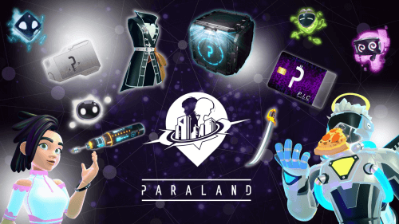

# 簡登慶 (Abel Jain) 
- Birthday: 1992/01/03
- Education:龍華科技大學 / 資訊網路工程系
- Location: New Taipei City
- E-mail: g9886327@gmail.com
- Mobile: 0988-138-024

### 專業技能
- 使用 Next.js 框架並搭配 TypeScript、tailwindcss、Material UI 做開發，將前後端分離，實作SSR、SSG技術
- 使用 Asp.Net Core 6.0 框架 架設MVC環境並實作網站管理及維護
- 熟悉 Javascript ES6、ES5語法。
- 熟悉 jQuery 並整合使用 jQuery 第三方套件
- 熟悉 Material UI 搭配 Next.js 快速開發響應式網頁並且模組化控管各種component
- 熟悉 Bootstrap 快速開發響應式網頁並且客製 Bootstrap 元件內容達到客戶想要的樣式。
- 熟悉 tailwindcss 快速開發響應式網頁達到客戶想要的樣式。
- 熟悉 HTML5 : 熟悉應用 HTML 標籤，熟悉如何切版且不依賴 Bootstrap 切出客戶需求的頁面
- 熟悉 CSS3 : 熟悉排版 了解如何正確使用 display(grid、flex、position、z-index、box-model、grid),熟悉 pseudo element
- 熟悉 Sass / SCSS : 將重用性的 CSS 模組化，加速開發並提高維護性
- 熟悉 響應式網頁(RWD) : 熟悉可不依賴套件並手刻切版；手機、平板、桌電三種適用的頁面
- 使用 Git / Git，並透過 Git flow 專案版本控制
- 使用 Azure 基礎知識，使用 Azure 雲服務來協助專案環境架設並完成客戶需求
- 使用 Azure azure function，運用 node.js 達成Table Storage 資料/get/post
- 使用 Azure DevOps，建置專案CI/CD自動化部屬流程
- 使用 Next.js 來完成前後端分離並透過  Redux 來統一管理資料狀態(實作中)
- 使用 AJAX , fetch 撈取遠端後端資料並渲染在網頁上、透過 fetch 使用 RESTful 理念操作
- 使用 Gulp, Webpack 打包檔案並提高網頁效率
- 使用 Painter 進行視覺流程製作，並將圖檔壓縮及改為 webp，提高載入效率
- 使用過多種 Plugin 搭配網頁達到多種特效，加速網頁開發
* 了解 SEO 搜尋引擎優化；了解 Google Analysit、GA4、GTM；了解相容性；有良好習慣性的註解以便維護及修改
* CSS Style 遵循 (OOCSS、BEM 之風格)，以便利後續維護及重複使用性
* JavaScript Coding Style 遵循 ESLint 風格，以利後續維護及閱讀。 

### 工作經驗 
-  工作期間 2021/01 - 在職 狂點軟體開發股份有限公司 
   職位:前端工程師  
   * 一人維護及架設內部所有網站
      * 遊戲網站後台
      * 遊戲官網
      * 官網活動頁面
      * 區塊鏈錢包網站
      * 官網網誌文章新增及維護
      * 維護官方網站及後台，並建立自動化流程
      * 優化 SEO、效能 及 Google、FB事件分析
      * 定期備份資料並且優化內部舊有程式碼
   * 其他外部專案
      * 【JJ Lin】360 互動式WebAR遊戲後半部遊戲更新及製作
      * 【JJ Lin】專輯網站更新及維護
      * 台新銀行WebAR遊戲網站畫面製作
      * 台灣電力公司WebAR遊戲網站畫面製作

   
### 作品集 
 # Paraland遊戲官網 (Paraland web)
 - <a href="http://www.paraland.world/" target="blank"><B>PARALAND -區塊鏈元宇宙社群手遊</B></a> 
   <a href="http://www.paraland.world/" target="blank"> </a>  
   ⌞ 使用 Asp.Net Core 以及 Bootstrap 完成，並用 i18n 支持多語言（中 / 英 / 日) 。 
   ⌞ 串接 web3.0 達到網站串接metamask錢包流程 
   ⌞ 使用多種 Plugin 搭配網頁達到多種特效，加速網頁開發 
   ⌞ 串接ipapi實作根據國籍地區呈現相應語系 
   ⌞ 使用 Gulp, Webpack 壓縮檔案並提高網頁效率 
   ⌞ 埋設 Google Analysit、GA4、GTM 來追蹤網站成效，並且設定轉換率確認使用者停留頁面等等事件 
   ⌞ 使用 SCSS 及 Webpack 提高網頁效率及程式碼整潔 
     
 # PARAZEN - AR NFT 先鋒者系列 (Parazen) 
 - <a href="http://www.paraland.world/parazen" target="blank"><B>PARAZEN - 首創 AR NFT 先鋒者系列</B></a>  
   <a href="http://www.paraland.world/parazen" target="blank"> </a>  
   ⌞ 使用 Asp.Net Core 以及 Bootstrap 完成，並用 i18n 支持多語言（中 / 英 / 日) 。 
   ⌞ 串接 web3.0 達到網站串接metamask錢包流程 
   ⌞ 使用多種 Plugin 搭配網頁達到多種特效，加速網頁開發 
   ⌞ 串接ipapi實作根據國籍地區呈現相應語系 
   ⌞ 埋設 Google Analysit、GA4、GTM 來追蹤網站成效，並且設定轉換率確認使用者停留頁面等等事件 
   ⌞ 使用 SCSS 及 Webpack 提高網頁效率及程式碼整潔 

 # PARASTAR - 元宇宙英雄篇章即將展開 (PARASTAR)
 - <a href="https://www.paraland.world/parastar/zh" target="blank"><B>PARASTAR活動網站 (活動已結束)</B> (RWD)</a>  
   <a href="https://www.paraland.world/parastar/zh" target="blank"> </a>  
  
  ⌞ 使用 Asp.Net Core 以及 Bootstrap 完成，在資料獲取完及運算後渲染至頁面。 
  ⌞ 使用 Fetch 串接後端api取得每項投票比數 
  ⌞ 實作 頁面間隔數秒重新get api，達到每隔10秒 update view，並實作排名動態更換 
  ⌞ 外部串接第三方 twitter and facebook api 達成自訂發文內容機制 
  ⌞ 使用fetch get第三方 twitter api，取得所有候選人帳號大頭貼並download post 到 cdn 
  ⌞ 使用 SCSS 及 Webpack 提高網頁效率及程式碼整潔 

  
 # 區塊鏈網站 (區塊鏈網站)
 - <a href="https://www.paraland.world/MyWallet/zh" target="blank"><B>區塊鏈魔盒網站</B></a>  
   <a href="https://www.paraland.world/MyWallet/zh" target="blank"> </a> 
   ⌞ 使用 Asp.Net Core以及 Bootstrap，在資料獲取完及運算後渲染至頁面。 
   ⌞ 串接區塊鏈 WEB3.0 ，實作開盒跟解盲畫面流程 
   ⌞ 串接 web3.0 實作網站連接metamask和 qubic 錢包 
   ⌞ 優化網站架構，未來朝會員管理頁面構想 
   ⌞ 使用多種 Plugin 搭配網頁達到多種特效，加速網頁開發 
   ⌞ 使用 SCSS 及 Webpack 提高網頁效率及程式碼整潔 

 # 區塊鏈募資活動網站 (區塊鏈募資活動網站)
 - <a href="https://paraland-testing.azurewebsites.net/PARALedger/store/zh" target="blank"><B>區塊鏈募資活動網站 (活動已結束)</B></a>  
   <a href="https://paraland-testing.azurewebsites.net/PARALedger/store/zh" target="blank"> </a> 
   ⌞ 使用 Asp.Net Core以及 Bootstrap，串接web3.0 實作電子錢包打幣流程 
   ⌞ 串接 web3.0 實作網站連接metamask和 qubic 錢包 
   ⌞ 串接區塊鏈 WEB3.0，並設計出斗內條UI得到目前募資額度 
   ⌞ 建立導數計時器，設立時間到斗內功能開關需求 
   ⌞ 優化網站架構，未來朝會員管理頁面構想 
   ⌞ 使用多種 Plugin 搭配網頁達到多種特效，加速網頁開發 
   ⌞ 使用 SCSS 及 Webpack 提高網頁效率及程式碼整潔 

   
 # 遊戲後台網站 (遊戲後台網站)
 - <a href="https://joechen0730.github.io/Vuex-todolist/" target="_blank"><B>遊戲後台網站</B></a>  
  <a href="https://joechen0730.github.io/Vuex-todolist/" target="_blank"> </a> 
  ⌞ 使用 Next.js，實作SSR 和 SSG 
  ⌞ 使用 tailwindcss實作UI畫面的製作跟整體風格規劃加速開發效率 
  ⌞ 使用 Material UI 配合tailwindcss，達成快速統一後台 UI 設計風格與功能 
  ⌞ 使用Data fetch，串接後端api，整合所有api並管理 
  ⌞ 使用Redux，並用 store 將 hook 狀態集中管理(實作中) 

### 其他外部專案  

 # 【JJ Lin】360 互動式WebAR遊戲後半部遊戲更新及製作
 - <a target="_blank"><B>360 互動式WebAR遊戲</B></a>  
  ⌞ 使用 a-frame達成WebAR360畫面視角移動 
  ⌞ 使用 jquery library撰寫互動式事件 
  ⌞ 維護並管理整體遊戲運作及UI 

  # 台新銀行WebAR遊戲網站
 - <a href="https://nice-wave-09f23e400.azurestaticapps.net/" target="_blank"><B>台新銀行WebAR遊戲網站</B></a>  
   <a href="https://nice-wave-09f23e400.azurestaticapps.net/" target="_blank"> </a> 
  ⌞ 使用 a-frame達成WebAR360畫面視角移動 
  ⌞ 使用 a-frame 撰寫邏輯達成物品視角拖曳及連線 
  ⌞ UI流程的畫面實作 
  ⌞ 使用 SCSS 提高網頁效率及程式碼整潔 
   

  # 台灣電力公司WebAR遊戲網站(正在進行中)
 - <a target="_blank"><B>台灣電力公司WebAR遊戲網站</B></a>  
  ⌞ 使用 a-frame達成WebAR360畫面視角移動 
  ⌞ 使用 a-frame 撰寫邏輯達成物品視角拖曳及連線 
  ⌞ UI流程的畫面實作 
  ⌞ 使用 SCSS 提高網頁效率及程式碼整潔 

